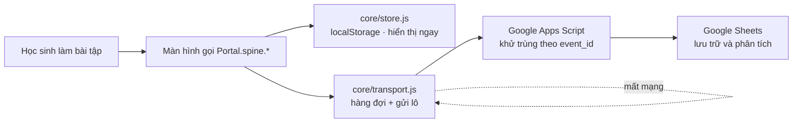

# SITE-SPEC.md — Đặc tả dựng lại trang English Insiders Learning Portal

Tài liệu thi công cho <https://hsg2627.github.io/>. Nói **dựng cái gì, đặt ở đâu,
gọi hàm nào** — không lặp lại phần "vì sao" đã có ở nơi khác.

**Thứ tự ưu tiên khi hai tài liệu mâu thuẫn:**

```
AGENTS.md  >  SITE-SPEC.md  >  DATA-DESIGN.md  ≈  CONTENT-SPEC.md  >  README.md
```

`AGENTS.md` là luật. Tài liệu này chỉ được **cụ thể hoá**, không được nới.

| Đọc trước | Để lấy |
|---|---|
| `AGENTS.md` | Luật cứng, mã định danh, banner AI, GA, quy trình pilot |
| `CONTENT-SPEC.md` | Chủ đề, 15 mục ngữ pháp, độ dài, typology 7 lỗi |
| `DATA-DESIGN.md` | Lược đồ JSON, `manifest`, `schedules`, `provenance` |
| `README.md` | Hợp đồng `Spine.*`, cách deploy Apps Script |

**Đặt một bản sao tệp này ở thư mục gốc của repo `hsg2627.github.io`,** cạnh
`AGENTS.md`. Tác nhân sửa mã phải thấy được cả hai.

---

## 0. Những chỗ đặc tả này lệch khỏi sơ đồ ban đầu

Sơ đồ thư mục ban đầu va vào luật trong `AGENTS.md`. Mỗi chỗ lệch ghi kèm cách
quay lại nếu chị không đồng ý.

### 0.1 `js/progress.js` không được tự quản lý localStorage

**Sơ đồ ban đầu:** `progress.js` — *"Quản lý tiến độ (localStorage + gửi lên GAS)"*.

**Vấn đề:** `AGENTS.md` §8 và `README.md` cấm màn hình đụng `localStorage`,
`fetch`, hay import `store`/`logger`/`transport`. Viết lại phần này là dựng một
xương sống thứ hai chạy song song với `core/` — hai hàng đợi, hai định nghĩa
phiên, hai bộ đếm XP lệch nhau, và không cách nào biết bộ nào đúng lúc phân tích.

**Cách làm ở đây:** giữ nguyên tên tệp, đổi vai trò. `js/progress.js` là **lớp
vỏ mỏng duy nhất được phép import `core/spine.js`**. Nó không tự lưu gì cả — nó
gọi `Spine.*` và vẽ giao diện tiến độ. Mọi `app.js` khác import `Portal` từ đây.

Nhờ vậy hợp đồng kiểm tra được bằng một lệnh, không cần chạy trang (§13.1).

### 0.2 `js/data.js` không chứa học liệu

**Sơ đồ ban đầu:** `data.js` — *"Dữ liệu tổng hợp (modules, units, grammar...)"*.

**Vấn đề:** `DATA-DESIGN.md` §1 quy định học liệu là **tệp JSON tĩnh** nạp bằng
`fetch`, siêu dữ liệu nghiên cứu nằm trong chính item. Đó cũng là đầu ra của
`Pipeline/` (`Pipeline/DESIGN.md`, chặng `publish`). Nhét học liệu vào một tệp
`.js` viết tay thì pipeline không xuất bản vào đâu được, và khối `provenance`
— vết kiểm toán thẩm định — không có chỗ đứng.

**Cách làm ở đây:** `js/data.js` chỉ chứa **danh mục điều hướng**: tên thẻ, mô
tả, biểu tượng, đường dẫn. Học liệu nằm ở `content/*.json`, nạp qua
`content/loader.js`.

### 0.3 Một tệp CSS, không phải bốn

**Sơ đồ ban đầu:** `css/style.css` ở gốc **và** ở `global-success/`, `practice/`,
`ai-logs/`.

**Vấn đề:** bốn tệp cùng tên ở bốn thư mục sẽ lệch nhau sau vài tuần sửa, và
không ai nhớ nút "Kiểm tra" lấy màu từ tệp nào. Với học sinh dùng 3G, một tệp
~12KB nạp một lần rồi cache cho mọi trang là nhanh hơn bốn tệp.

**Cách làm ở đây:** một `/css/style.css` duy nhất, chia mục bằng bình luận.

**Nếu chị vẫn muốn tách:** đặt tên `module.css` (không trùng `style.css`), nạp
**sau** tệp gốc, và chỉ chứa phần riêng của module — không định nghĩa lại token.

### 0.4 Global Success là module **của giáo viên**, có khoá

**Chốt ngày 2026-08-26:** `Global_Success_10/` không phải học liệu tự học của
học sinh. Đó là **bài giảng HTML để giáo viên trình chiếu trên lớp** — 10 units ×
8 lessons + 4 reviews, đã dựng xong trong repo. Chỉ tài khoản giáo viên mở được;
ai đã nhập mã học sinh thì **bị khoá**.

**Và nó nằm ngoài phạm vi nghiên cứu.** Học liệu được đo trong luận văn là
**Practice Center + AI Error Log + xương sống log**. Global Success 10 chỉ là
công cụ dạy học đặt nhờ trên cùng tên miền cho tiện. Bốn hệ quả, cả bốn đều phải
giữ:

1. **Không chịu ràng buộc của `CONTENT-SPEC.md`.** Bài giảng bám sách giáo khoa,
   được phép dùng cấu trúc ngoài danh mục 15 mục và độ dài ngoài §4. Đừng đem
   bốn chốt thẩm định ra soi nó — soi nhầm chỗ thì tốn công mà không được gì.
2. **Không sinh một dòng log nào** (§8.1). Không có số nào của luận văn đi ra từ
   đây, nên không cần đo, và đo là làm bẩn dữ liệu.
3. **Không mô tả nó như một phần của can thiệp** trong luận văn. Chỗ nào tả sản
   phẩm (mục 3.3, 4.2 của đề cương) phải nói rõ artefact được đo gồm những gì, và
   loại trừ phần này ra.
4. **Nhưng phải khai nó như biến bối cảnh.** Nếu chính giáo viên đó dạy hai lớp
   trong mẫu bằng bài giảng này, thì cả mẫu nhận thêm một nguồn tác động trên
   cùng nội dung chương trình. Thiết kế không có nhóm đối chứng nên chênh lệch
   trước/sau vốn đã không quy hết về tự học được; khai ra một dòng ở phần bối
   cảnh là đủ, và là điều hội đồng sẽ hỏi nếu chị không khai trước.

Điều đó giải luôn mâu thuẫn tên gọi. Luật "neo vào CT 2018, không neo vào sách
giáo khoa" (`AGENTS.md` §13) áp cho **học liệu sinh item đo lường** — thứ mà đề
cương phải chứng minh là bám chương trình. Bài giảng của giáo viên thì bám đúng
bộ sách lớp đó đang học, và tên "Global Success 10" là mô tả trung thực chứ
không phải cam kết học thuật. **Giữ nguyên tên thư mục `Global_Success_10/`.**

**Hệ quả:** bỏ luôn `/english10/` khỏi phía học sinh. Học sinh chỉ có `/practice/`
(5 kỹ năng) và `/ai-logs/` — đúng như sơ đồ ban đầu của chị. Không dựng hai
đường vào cùng một nội dung.

> ⚠️ **Đọc §9.2 trước khi dựng khoá.** Trang tĩnh trên GitHub Pages **không khoá
> được thật**. Cơ chế ở §9.2 chặn được học sinh đi theo giao diện, không chặn
> được em nào gõ thẳng đường dẫn tệp. §9.2 nói rõ khi nào chừng đó là đủ và khi
> nào không.

### 0.4b Không thêm bản dịch tiếng Việt dưới cảnh báo AI

**Chốt ngày 2026-08-26:** banner AI **chỉ có văn bản tiếng Anh**, nguyên văn theo
`AGENTS.md` §6. Không thêm dòng tiếng Việt bên dưới. Đề xuất dịch ở bản trước đã
bị bác — đừng đưa lại.

### 0.5 Ba việc bổ sung mà sơ đồ chưa có

| Thêm | Vì sao |
|---|---|
| `core/` | Xương sống đã viết xong ở `Platform/core/`. Chép sang, không viết lại. |
| `content/` | Học liệu JSON theo `DATA-DESIGN.md`. |
| `me/` | Màn hình *Dữ liệu của tôi* — `Spine.exportMyData()` / `deleteMyData()`. Là cam kết đạo đức trong đơn đồng ý của phụ huynh, không phải tính năng phụ. |

---

## 1. Thiết kế cho học sinh lớp 10

Tám luật giao diện. Mọi màn hình phải qua được cả tám.

**Điện thoại trước.** Đa số các em mở bằng điện thoại. Thiết kế ở bề rộng 360px
trước, rồi mới nới ra máy tính. Không có bố cục nào chỉ chạy được trên màn rộng.

**Hai chạm tới bài tập.** Từ trang chủ tới câu hỏi đầu tiên tối đa hai lần chạm.
Ba lần là thiết kế hỏng, không phải là "cấu trúc rõ ràng".

**Vùng chạm ≥ 48px.** Nút, thẻ, phương án trả lời. Cách nhau ≥ 8px để ngón tay
cái không bấm nhầm.

**Chữ 17px, dòng 1.6.** Ô nhập liệu **phải** `font-size: 16px` trở lên — nhỏ hơn
thì iOS tự phóng to trang khi các em gõ mã.

**Điều hướng giống nhau ở mọi trang.** Thanh dưới cùng trên điện thoại, thanh
trên cùng ở máy tính. Không có trang nào là ngõ cụt.

**Tiếng Việt cho hướng dẫn, tiếng Anh cho học liệu.** Mọi câu lệnh giao diện
bằng tiếng Việt. Nội dung tiếng Anh bọc trong `<span lang="en">`.

**Phản hồi trước, phần thưởng sau.** Trả lời xong: hiện đúng/sai và **giải
thích** trước; hiệu ứng XP/streak hiện sau, khi các em đã đọc. Đây là bình luận
có sẵn trong `spine.js` — làm ngược lại thì các em xem điểm, bỏ qua giải thích,
và mất luôn giá trị sư phạm.

**Không có ngõ cụt và không có màn hình trống.** Mỗi trạng thái rỗng phải có một
câu và một nút: "Chưa có bài nào ở đây. Về trang Luyện tập →".

### Bảng màu và nhận diện — giữ nguyên

`AGENTS.md` §12 cấm tự đổi tên, favicon, bảng màu. Bảng màu chính thức lấy
nguyên từ `Platform/index.html`, chép vào §5.1 dưới đây. **Không thêm màu mới.**

---

## 2. Cây thư mục cuối cùng

```
hsg2627.github.io/
├── AGENTS.md                      # bản sao — luật cứng
├── SITE-SPEC.md                   # bản sao — tệp này
├── .nojekyll                      # tắt Jekyll, tránh nuốt tệp lạ
├── 404.html                       # trang lạc đường, có nút về trang chủ
├── favicon.svg
├── index.html                     # Trang chủ
│
├── css/
│   └── style.css                  # TOÀN BỘ giao diện — một tệp duy nhất
│
├── js/
│   ├── progress.js                # ⭐ tệp DUY NHẤT được import core/spine.js
│   ├── data.js                    # danh mục điều hướng (KHÔNG chứa học liệu)
│   └── app.js                     # logic trang chủ
│
├── core/                          # XƯƠNG SỐNG — chép từ Platform/core/, đừng viết lại
│   ├── config.js
│   ├── util.js
│   ├── identity.js
│   ├── store.js
│   ├── logger.js
│   ├── transport.js
│   └── spine.js
│
├── content/                       # HỌC LIỆU — đầu ra của Pipeline/
│   ├── loader.js                  # nạp + cache JSON (không đụng core/)
│   ├── manifest.json
│   ├── schedules.json
│   ├── grammar/    g01.json … g14.json
│   ├── vocab/      u01.json … u10.json
│   ├── skills/     u06-reading.json, u06-listening.json, u06-writing.json …
│   ├── exams/      hk1-01.json, hk2-01.json …
│   └── ai-eval/    ae-hk1.json, ae-hk2.json
│
├── assets/
│   ├── audio/                     # CHỈ 5 unit HK2 — xem §9.4
│   └── images/
│
├── Global_Success_10/             # 🔒 GIÁO VIÊN — bài giảng trình chiếu, đã dựng xong
│   ├── index.html                 #    thêm cổng khoá ở đầu (§9.2)
│   ├── css/gs10.css
│   ├── js/
│   │   ├── gs10-player.js
│   │   └── gs10-gate.js           #    MỚI — cổng khoá, KHÔNG ghi log
│   ├── data/  units_meta.json · unit01…unit10.json · reviews.json
│   └── assets/ audio · images · videos
│
├── practice/                      # 📝 Luyện tập
│   ├── index.html
│   ├── js/app.js
│   ├── grammar/     index.html + js/app.js
│   ├── vocabulary/  index.html + js/app.js
│   ├── listening/   index.html + js/app.js
│   ├── writing/     index.html + js/app.js
│   └── exam/        index.html + js/app.js
│
├── ai-logs/                       # 🤖 Xưởng AI — Miền 6
│   ├── index.html
│   └── js/app.js
│
└── me/                            # 👤 Dữ liệu của tôi
    ├── index.html
    └── js/app.js
```

**Đường dẫn trong HTML dùng dấu `/` mở đầu** (`/css/style.css`, `/js/progress.js`).
Trang chạy ở gốc tên miền `hsg2627.github.io` nên tuyệt đối là đúng và không vỡ
khi lồng thư mục. *Chỉ khi nào* chuyển sang repo dự án (`user.github.io/repo/`)
mới phải đổi sang tương đối — lúc đó sửa một lượt bằng tìm–thay.

---

## 3. Bảng đường dẫn

| Trang | Đường dẫn | Điều hướng chung | Nội dung |
|---|---|---|---|
| Trang chủ | `/` | có | Chào + tiến độ + 2 thẻ lớn + nhiệm vụ hôm nay |
| Luyện tập | `/practice/` | có | 5 thẻ kỹ năng |
| Ngữ pháp | `/practice/grammar/` | có | 14 module ngữ pháp |
| Làm ngữ pháp | `/practice/grammar/?g=g07` | có | Chuỗi câu hỏi |
| Từ vựng | `/practice/vocabulary/` | có | 10 bộ từ theo chủ đề |
| Làm từ vựng | `/practice/vocabulary/?unit=6` | có | Thẻ ghi nhớ + câu hỏi |
| Nghe | `/practice/listening/` | có | 5 bài nghe HK2 |
| Viết | `/practice/writing/` | có | 5 đề viết HK2 |
| Đề luyện | `/practice/exam/` | có | Đề HK1, HK2 |
| Xưởng AI | `/ai-logs/` | có | 7 hạng mục lỗi |
| Làm xưởng AI | `/ai-logs/?set=ae-hk2` | có | Chuỗi tác vụ đánh giá |
| Dữ liệu của tôi | `/me/` | có | Tiến độ, tải về, xoá |
| Lạc đường | `/404.html` | có | Một câu + nút về trang chủ |
| 🔒 **Bài giảng (giáo viên)** | `/Global_Success_10/` | **không** | Cổng khoá → 10 units × 8 lessons + 4 reviews |

Trang bài giảng **không** mang thanh điều hướng học sinh, **không** mang HUD tiến
độ, và **không** ghi bất kỳ dòng log nào. Nó không phải một màn hình của học
sinh — nó là công cụ của giáo viên tình cờ nằm chung tên miền. Xem §9.2.

**Điều hướng có ở mọi trang.** Sơ đồ ban đầu chỉ để sidebar ở trang chủ; như vậy
mọi trang trong là ngõ cụt và học sinh phải bấm nút Back của trình duyệt — thứ
mà trên điện thoại nhiều em không dùng.

### Ba điều rút ra từ cách đặt đường dẫn này

**Không còn định tuyến bằng hash.** `AGENTS.md` §10 cảnh báo GA4 không tính lượt
xem khi trang đổi `#hash`. Cấu trúc nhiều tệp `index.html` này làm mỗi lần chuyển
màn hình là **một lượt tải trang thật**, nên GA đếm đúng mà không cần bật thêm
gì. Bẫy đó biến mất cùng với trang cũ.

**Tham số `?unit=`, `?g=`, `?set=` phải là liên kết thật** (`<a href>`), không
phải `history.pushState`. Đổi query bằng JavaScript thì lại rơi vào đúng bẫy
trên. Giữ tên `unit` với số nguyên (`?unit=6`) vì `js/app.js` hiện đã dùng đúng
tên đó — đổi sang `?u=u06` là thêm một chỗ phải sửa mà không được gì.

**Phiên học không đứt khi chuyển trang.** `logger.js` giữ `session_id` trong
`localStorage` và chỉ ghi `session_start` khi thật sự mở phiên mới — đã kiểm
chứng ở `README.md`. Nhiều trang không sinh thêm phiên giả.

---

## 3.1 Xây lại trên nền sạch

**Quyết định 2026-08-26: xoá hết thư mục cũ, dựng lại theo cây §2.** Không di
trú, không giữ SPA hash, không gỡ dần từng mảnh. Mục này nói **cứu gì trước khi
xoá** và **những gì đang chạy được thì đừng làm lại từ trí nhớ**.

### 3.1.0 Xoá là hoàn tác được — nếu giữ `.git`

Toàn bộ repo đã commit tới `cb75168`, sạch (chỉ `index.html` đang có sửa đổi
chưa commit). Nghĩa là xoá thư mục **không mất gì vĩnh viễn**, miễn là:

- **Không đụng vào `.git/`.** Đây là ranh giới duy nhất. Xoá `.git` là mất thật.
- **Commit bản hiện tại trước khi xoá**, đặt một nhãn để sau này lấy lại:

```bash
git add -A && git commit -m "chore: snapshot truoc khi dung lai theo SITE-SPEC" && git tag pre-rebuild
```

Có nhãn `pre-rebuild` thì mọi tệp cũ lấy lại được bằng
`git checkout pre-rebuild -- <đường dẫn>` bất cứ lúc nào, kể cả sáu tháng sau.
Làm bước này trước, hai phút, đổi lại là không bao giờ phải tiếc.

### 3.1.1 Cứu sáu thứ này ra khỏi đợt xoá

Chép sang một thư mục tạm ngoài repo trước khi xoá, rồi chép trở lại vào cây mới.
Đây đều là thứ **không dựng lại được bằng cách viết mã**:

| Cứu | Dung lượng | Về đâu trong cây mới | Vì sao |
|---|---|---|---|
| `Global_Success_10/` | 4,6MB | nguyên chỗ cũ | 10 units × 8 lessons + 4 reviews. Công lớn nhất trong repo |
| `core/` | 44KB | `/core/` | Xương sống đã kiểm chứng. Không viết lại (§6.6) |
| `data/ai-eval-bank.json` | 21KB | `content/ai-eval/` | **Ngân hàng đánh giá AI** — bước chặn cả luận văn (§9.6) |
| `data/vocab-eng10.json` | 486KB | `content/vocab/` | 10 unit từ vựng đã soạn |
| `data/eng10-units.json` · `listening-writing-eng10.json` | 276KB | `content/skills/` | Ngữ liệu bốn kỹ năng |
| `images/English_Insider_Logo.svg` | | `/assets/images/` | Nhận diện — `AGENTS.md` §12 cấm đổi |

**Không cứu:** `data/vocab-c1c2.json`, `data/hsg12-topics.json`,
`collocations_data.js`, `test*.html`, `ocr_dump.json`, `scratch/`. Xem §10.

**Cân nhắc riêng `images/` — 44MB.** Cả thư mục nặng 44MB, quá lớn cho một repo
trang tĩnh và gần như chắc chắn có ảnh không trang nào dùng. Đừng chép cả cụm
sang cây mới. Cách làm: chép **logo trước**, rồi mỗi lần một màn hình cần ảnh thì
lấy đúng tệp ấy từ `git checkout pre-rebuild -- images/<tệp>`. Ảnh nào sáu tháng
không ai lấy ra thì đúng là không cần.

**Và `audio/` — một tệp 9,6MB.** Cả thư mục chỉ có `04_Track_4.mp3` nặng 9,6MB.
Một bài nghe 180–200 từ (`CONTENT-SPEC.md` §4) mà 9,6MB là sai định dạng, không
phải sai nội dung — nén lại còn mono 64kbps trước khi đưa vào `assets/audio/`,
xuống dưới 2MB. Học sinh dùng 3G không tải nổi 9,6MB cho một bài tập.

### 3.1.2 Kiểm kê chức năng đang chạy được

Xây lại giao diện không có nghĩa là quên những gì đã làm được. Chín màn hình của
SPA cũ và hàm dựng chúng — đọc trước khi viết màn hình tương ứng, ít nhất là để
biết dữ liệu vào ra hình dạng thế nào:

| Hash cũ | Panel trong `index.html` | Hàm render | Route mới | Tệp mới |
|---|---|---|---|---|
| `#home` | `overview-view` | markup tĩnh | `/` | `index.html` + `js/app.js` |
| `#dashboard` | `dashboard-view` | `renderDashboard()` :1023 | `/me/` | `me/index.html` + `me/js/app.js` |
| `#gs10` | `gs10-view` | markup tĩnh (thẻ dẫn) | `/Global_Success_10/` | **đã có** |
| `#grammar` · `#english10` | `grammar-view` | markup + `openModule` :770 | `/practice/grammar/` | `practice/grammar/` |
| `#vocab` | `vocab-view` | `renderVocabStudio()` :180 | `/practice/vocabulary/` | `practice/vocabulary/` |
| `#listening` | `listening-view` | `renderListeningLab()` :525 | `/practice/listening/` | `practice/listening/` |
| `#writing` | `writing-view` | `renderWritingStudio()` :684 | `/practice/writing/` | `practice/writing/` |
| `#quiz` | `quiz-hub-view` | markup + `QuizEngine` | `/practice/exam/` | `practice/exam/` |
| `#ai-error-log` | `ai-error-log-view` | `renderAiEvalTasks()` :867 | `/ai-logs/` | `ai-logs/` |

Số dòng theo `js/app.js` bản ngày 2026-08-26 (lấy lại bằng
`git show pre-rebuild:js/app.js`). Ba điều đáng biết trước khi viết lại:

- `renderAiEvalTasks()` **không** nằm trong `switchView()` mà gọi thẳng ở dòng
  1148 lúc tải trang — nếu chỉ đọc router sẽ tưởng màn hình Xưởng AI chưa có.
- `js/app.js` cũ `import { Spine }` thẳng ở dòng 6 và phơi `window.SpineHelper`
  ở dòng 33. **Bản mới đi qua `Portal`** (§6.1) — đừng chép lại thói quen này.
- `js/quiz-engine.js` là `window.QuizEngine`, một IIFE độc lập, không dính vào
  router. Đây là mảnh **chép sang được gần như nguyên vẹn**.

**Không giữ lại router.** Không `viewMap`, không `switchView()`, không
`hashchange`, không `.view-panel`/`.active`. Trình duyệt là router. Dựng lại một
router phía client là đi hết một vòng để về đúng chỗ vừa rời khỏi.

**URL cũ không cần chuyển hướng.** Chưa thu dữ liệu, `ENDPOINT` còn rỗng, chưa
học sinh nào có bookmark. Các tệp `english10.html`, `hsg12.html`, `vocab.html`,
`grammar.html`, `listening.html`, `reading.html`, `dashboard.html`,
`test*.html` — **xoá thẳng**, không cần tệp chuyển hướng nào. Trường hợp duy
nhất còn lý do giữ là `global-success-10.html` nếu giáo viên đã lưu đường dẫn
ấy; hỏi một câu là biết, không đoán.

### 3.1.3 Bốn điều riêng của GitHub Pages

**Luôn viết dấu `/` cuối.** `/practice/grammar/` chứ không phải
`/practice/grammar`. Thiếu dấu thì GitHub Pages trả 301 rồi mới tới nơi — thừa
một vòng trên 3G, và đường dẫn tương đối trong trang tính sai một cấp.

**Không có rewrite phía máy chủ.** Mỗi route là một thư mục có `index.html` thật.
Đừng thiết kế đường dẫn kiểu `/practice/grammar/g07` — không có gì phục vụ nó.
Tham số phụ đi bằng query (`?g=g07`).

**`404.html` ở gốc là lưới hứng.** Gõ sai đường dẫn thì rơi vào đó — giữ thanh
điều hướng trong tệp này để học sinh bấm về được, đừng để một dòng chữ trống.

**`.nojekyll`.** Không có nó, GitHub Pages chạy Jekyll và bỏ qua mọi thư mục và
tệp bắt đầu bằng `_`. Một tệp rỗng, thêm cho xong chuyện.

### 3.1.4 Google Analytics — bẫy hash không còn

`AGENTS.md` §10 dặn phải bật *Enhanced measurement → Page changes based on
browser history events* vì trang dùng hash. **Sau khi dựng lại, dặn đó hết hiệu
lực:** mỗi màn hình là một lượt tải thật nên `page_view` tự bắn. Để bật cũng
không sao — nó chỉ kích hoạt khi có `pushState` hoặc đổi hash, mà cả hai đều
không còn. Ghi một dòng vào `AGENTS.md` §10 rằng bẫy này đã xử lý, đừng để người
sau đi bật lại rồi thắc mắc.

---

## 4. Khung HTML chuẩn

Mọi trang bắt đầu từ khung này. Chỉ đổi `<title>`, phần `<main>`, và đường dẫn
`app.js` ở cuối.

```html
<!doctype html>
<html lang="vi">
<head>
<meta charset="utf-8">
<meta name="viewport" content="width=device-width, initial-scale=1">
<title>Ngữ pháp · English Insiders Learning Portal</title>
<meta name="description" content="Học liệu số Tiếng Anh 10 theo Chương trình GDPT 2018.">
<link rel="icon" href="/favicon.svg">
<link rel="stylesheet" href="/css/style.css">

<!-- Google Analytics — CHỈ giám sát vận hành. Không bao giờ nhận mã học sinh. -->
<script async src="https://www.googletagmanager.com/gtag/js?id=G-XXXXXXXXXX"></script>
<script>
  window.dataLayer = window.dataLayer || [];
  function gtag(){ dataLayer.push(arguments); }
  gtag('js', new Date());
  gtag('config', 'G-XXXXXXXXXX', {
    anonymize_ip: true,
    allow_google_signals: false,
    allow_ad_personalization_signals: false
  });
</script>
</head>
<body>

<!-- ═══ BANNER — KHÔNG XOÁ, KHÔNG THU NHỎ, KHÔNG ĐƯA VÀO <details> ═══ -->
<header class="topbar">
  <a class="brand" href="/">English Insiders Learning Portal</a>
  <p class="ai-notice" lang="en">
    🤖 All study materials are generated by AI and may contain inaccuracies.
    Please verify critical information independently.
  </p>
</header>

<!-- Thanh tiến độ — progress.js vẽ vào đây -->
<div class="hud" id="hud" hidden></div>

<main class="wrap" id="main">
  <!-- Nội dung riêng của từng trang -->
</main>

<!-- Điều hướng: thanh dưới trên điện thoại, thanh trên ở máy tính -->
<nav class="tabbar" id="tabbar" aria-label="Điều hướng chính"></nav>

<script type="module" src="/practice/grammar/js/app.js"></script>
</body>
</html>
```

### Bốn luật về banner AI

Lấy nguyên từ `AGENTS.md` §6, nhắc lại vì đây là chỗ dễ bị "dọn dẹp" nhất.

1. **Văn bản tiếng Anh giữ nguyên từng chữ.** Không rút gọn, không diễn đạt lại,
   không dịch đè lên. Mở đầu bằng 🤖.
2. **Thường trực trên mọi màn hình.** Không phải popup đóng một lần. Không nằm
   trong `<details>`, không ẩn sau nút "xem thêm", không đẩy xuống chân trang.
3. **Tương phản đủ đọc.** Dùng `--ink` trên `--sunk`, không dùng `--muted` cỡ
   nhỏ.
4. **Gắn nhãn ở cấp item.** Mọi item có `ai_generated: true` hiện chip 🤖 ngay
   tại item. Học sinh cần biết **cái đang làm** do AI sinh.

**Chỉ tiếng Anh. Không dịch, không thêm dòng tiếng Việt bên dưới** (§0.4b).

Banner phải có ở **cả** `/Global_Success_10/` — bài giảng cũng do AI sinh, và
giáo viên trình chiếu cho cả lớp xem thì cảnh báo lại càng phải thấy được. Bản
hiện tại đã có (`.ai-banner-strip`); giữ nguyên.

---

## 5. Hệ thiết kế — `/css/style.css`

### 5.1 Token — chép nguyên, không thêm màu

```css
:root{
  --paper:#FBFAF7; --surface:#fff; --sunk:#F4F2EC;
  --ink:#1A1F35; --muted:#5C6079; --navy:#283567; --brass:#8A6A1C;
  --rule:#E4E0D6; --ok:#2A6B3F; --crit:#A32D22;

  --tap:48px;            /* vùng chạm tối thiểu */
  --gap:12px;
  --radius:10px;
  --wrap:680px;          /* bề rộng đọc tối đa */
}
@media (prefers-color-scheme:dark){
  :root{
    --paper:#13161F; --surface:#1A1E2A; --sunk:#20242F;
    --ink:#E9E7E1; --muted:#9BA0B4; --navy:#A3B1E4; --brass:#D8B75F;
    --rule:#2C3140; --ok:#7EC194; --crit:#E98A7C;
  }
}
```

Nền tối đảo vai `--navy` và `--paper`: nút nền `--navy` chữ `--paper` ở nền sáng
thì ở nền tối phải là nút nền `--navy` chữ `#13161F`. Kiểm bằng mắt trên máy
thật, đừng tin con số tương phản tính ở nền sáng.

### 5.2 Nền tảng

```css
*{box-sizing:border-box}
html{-webkit-text-size-adjust:100%}
body{
  margin:0; background:var(--paper); color:var(--ink);
  font:17px/1.6 system-ui,"Segoe UI",Roboto,sans-serif;
  -webkit-font-smoothing:antialiased;
  padding-bottom:calc(64px + env(safe-area-inset-bottom)); /* chừa chỗ tabbar */
}
.wrap{max-width:var(--wrap);margin:0 auto;padding:18px 16px 40px}
:focus-visible{outline:2px solid var(--brass);outline-offset:2px}
@media (min-width:768px){ body{padding-bottom:0} }
```

### 5.3 Banner và HUD

```css
.topbar{background:var(--sunk);border-bottom:1px solid var(--rule);padding:10px 16px}
.brand{
  display:block;font-weight:700;font-size:15px;letter-spacing:.02em;
  color:var(--navy);text-decoration:none;text-transform:uppercase;
}
.ai-notice{
  margin:6px 0 0;font-size:13.5px;line-height:1.45;color:var(--ink);
  border-left:3px solid var(--brass);padding-left:10px;
}

/* HUD: cấp độ · XP · chuỗi đúng · số đang chờ gửi */
.hud{
  display:flex;gap:14px;align-items:center;flex-wrap:wrap;
  max-width:var(--wrap);margin:0 auto;padding:8px 16px;
  font-size:13px;color:var(--muted);
}
.hud b{color:var(--ink);font-variant-numeric:tabular-nums}
.hud .bar{flex:1;min-width:120px;height:8px;background:var(--sunk);
  border:1px solid var(--rule);border-radius:99px;overflow:hidden}
.hud .bar>i{display:block;height:100%;background:var(--brass)}
```

### 5.4 Thẻ điều hướng — đích chạm là cả thẻ

```css
.cards{display:grid;gap:var(--gap);grid-template-columns:1fr}
@media (min-width:600px){ .cards{grid-template-columns:1fr 1fr} }

.card{
  display:block;background:var(--surface);border:1px solid var(--rule);
  border-radius:var(--radius);padding:16px;text-decoration:none;color:inherit;
  min-height:var(--tap);
}
.card:active{background:var(--sunk)}
.card h3{margin:0 0 4px;font-size:1.05rem;color:var(--navy)}
.card p{margin:0;font-size:14px;color:var(--muted)}
.card .ico{font-size:26px;line-height:1;display:block;margin-bottom:8px}
.card .meta{margin-top:10px;font-size:12.5px;color:var(--muted);
  display:flex;gap:10px;flex-wrap:wrap}
```

Cả thẻ là một thẻ `<a>`. Không đặt nút bên trong thẻ — hai đích chạm lồng nhau
là lỗi hay gặp nhất trên điện thoại.

### 5.5 Nút

```css
.btn{
  font:inherit;font-weight:600;font-size:16px;
  min-height:var(--tap);padding:12px 18px;border:none;border-radius:var(--radius);
  background:var(--navy);color:var(--paper);cursor:pointer;
}
.btn.ghost{background:transparent;color:var(--navy);border:1.5px solid var(--navy)}
.btn.danger{background:var(--crit);color:#fff}
.btn:disabled{opacity:.45;cursor:not-allowed}
.btn-row{display:flex;gap:10px;flex-wrap:wrap;margin-top:16px}
.btn-wide{width:100%}
```

### 5.6 Phương án trả lời — thành phần quan trọng nhất

```css
.opt{
  display:block;width:100%;text-align:left;font:inherit;font-size:16.5px;
  min-height:52px;padding:14px 16px;margin-bottom:10px;
  background:var(--surface);color:var(--ink);
  border:1.5px solid var(--rule);border-radius:var(--radius);cursor:pointer;
}
.opt[aria-pressed="true"]{border-color:var(--navy);background:var(--sunk)}
.opt.is-correct{border-color:var(--ok);background:color-mix(in srgb,var(--ok) 12%,transparent)}
.opt.is-wrong  {border-color:var(--crit);background:color-mix(in srgb,var(--crit) 12%,transparent)}
.opt .key{font-weight:700;color:var(--muted);margin-right:10px}
```

Đúng/sai **không được chỉ báo bằng màu** — thêm ký hiệu `✓` / `✗` vào đầu phương
án. Học sinh mù màu và điện thoại phơi nắng đều cần điều này.

### 5.7 Ô phản hồi

```css
.fb{border-left:3px solid var(--ok);background:var(--sunk);
    padding:14px 16px;border-radius:0 var(--radius) var(--radius) 0;margin:16px 0}
.fb.bad{border-left-color:var(--crit)}
.fb h4{margin:0 0 6px;font-size:15px}
.fb p{margin:0;font-size:15px;line-height:1.55}

/* Hiệu ứng XP — hiện SAU khi học sinh đã đọc phản hồi */
.toast{
  position:fixed;left:50%;transform:translateX(-50%);
  bottom:calc(76px + env(safe-area-inset-bottom));
  background:var(--navy);color:var(--paper);padding:10px 18px;
  border-radius:99px;font-size:14px;font-weight:600;z-index:50;
}
@media (min-width:768px){ .toast{bottom:24px} }
```

### 5.8 Chip 🤖 cấp item

```css
.chip-ai{
  display:inline-flex;align-items:center;gap:5px;
  font-size:12px;font-weight:600;color:var(--brass);
  border:1px solid var(--brass);border-radius:99px;padding:2px 9px;
}
```

Dùng ở **mọi** item có `ai_generated: true`, không riêng Xưởng AI.

### 5.9 Điều hướng

```css
.tabbar{
  position:fixed;left:0;right:0;bottom:0;z-index:40;
  display:grid;grid-template-columns:repeat(4,1fr);
  background:var(--surface);border-top:1px solid var(--rule);
  padding-bottom:env(safe-area-inset-bottom);
}
.tabbar a{
  display:flex;flex-direction:column;align-items:center;justify-content:center;
  gap:2px;min-height:56px;font-size:11px;color:var(--muted);text-decoration:none;
}
.tabbar a .ico{font-size:20px}
.tabbar a[aria-current="page"]{color:var(--navy);font-weight:700}

@media (min-width:768px){
  .tabbar{position:static;grid-template-columns:none;display:flex;
    justify-content:center;gap:8px;border-top:none;border-bottom:1px solid var(--rule)}
  .tabbar a{flex-direction:row;min-height:44px;padding:0 14px;font-size:14px}
}
```

Bốn mục, đúng thứ tự này: 🏠 Trang chủ · 📝 Luyện tập · 🤖 Xưởng AI · 👤 Của tôi.

**Không có mục nào trỏ tới bài giảng của giáo viên.** Lối vào duy nhất là một
liên kết nhỏ ở chân trang chủ (§9.1) — thấy được với người biết đường, không nằm
trong tầm mắt học sinh đang lướt.

### 5.10 Bốn thứ không được dùng

| Cấm | Vì sao |
|---|---|
| Phông chữ tải từ Google Fonts | Chặn hiển thị trên 3G, và là một lần gọi ra ngoài không cần thiết |
| Hiệu ứng chuyển màn hình > 200ms | Trên máy giá rẻ thành giật; các em tưởng máy treo rồi bấm lại |
| Đồng hồ đếm ngược ở bài luyện | Bài luyện không phải bài kiểm tra. `latency_ms` đo được rồi mà không cần gây áp lực |
| Modal chồng modal | Trên màn 360px không thoát ra được |

---

## 6. Tầng JavaScript

### 6.1 Sơ đồ nhập khẩu — đọc kỹ, đây là chỗ dễ sai nhất

```
core/spine.js
     ▲
     │ (import — CHỈ MỘT chỗ trong toàn bộ trang)
     │
js/progress.js  ──────────────┐
     ▲                        │
     │ import { Portal }      │  import { loadJSON }
     │                        ▼
mọi */js/app.js  ◄──── content/loader.js
```

**Luật:** `js/progress.js` là tệp duy nhất chứa chuỗi `core/spine.js`. Không
`app.js` nào được import bất cứ thứ gì trong `core/`. Kiểm bằng §13.1.

`content/loader.js` **được phép** dùng `fetch` và `localStorage` — nó nạp và
cache **học liệu**, không phải sự kiện. `DATA-DESIGN.md` §10 quy định như vậy.
Đây là ngoại lệ duy nhất; ghi rõ ở đầu tệp để không ai "sửa" nhầm.

### 6.2 `js/progress.js`

```js
// js/progress.js — lớp vỏ DUY NHẤT quanh xương sống.
//
// KHÔNG tự lưu trạng thái. KHÔNG tự gửi mạng. Mọi thứ đi qua Spine.
// Tệp này là chỗ duy nhất trong trang được import core/.

import { Spine } from '/core/spine.js';
import { NAV } from '/js/data.js';

export const Portal = {
  spine: Spine,

  /**
   * Gọi ở dòng đầu mọi app.js.
   *   await Portal.boot({ module:'grammar', unit:null, tab:'practice' })
   * Trả về { ok } — false nghĩa là đang hiện cổng nhập mã, app.js dừng lại.
   */
  async boot({ module, unit = null, tab } = {}) { /* xem bên dưới */ },

  /**
   * Chỉ đọc mã đã lưu, KHÔNG khởi động xương sống, KHÔNG ghi log.
   * Trả về 'student' | 'teacher' | 'guest'. Dùng cho cổng khoá §9.2.
   */
  role() {
    const id = Spine.id;                       // getter thuần, không sinh sự kiện
    if (!id) return 'guest';
    return /^GV-/i.test(id) ? 'teacher' : 'student';
  },

  renderHud(),         // vẽ #hud: cấp độ, XP tới cấp sau, chuỗi đúng, số chờ gửi
  renderTabbar(tab),   // vẽ #tabbar, đánh dấu aria-current
  toast(text),         // .toast, tự ẩn sau 1800ms
  crumb(text, href),   // "← Về Luyện tập" đầu <main>
  empty(text, href, label),  // trạng thái rỗng — không bao giờ để trắng
};
```

`Portal.role()` an toàn vì `Spine.id` chỉ đọc `Identity` — `logger.js` và
`transport.js` chỉ chạy khi có ai gọi `Spine.init()` hay `Spine.signIn()`. **Chỉ
import `spine.js` rồi đọc `Spine.id` thì không sinh dòng log nào.** Đây là điều
kiện để §9.2 khoá được bài giảng mà không làm bẩn dữ liệu.

`Portal.boot()` làm đúng bảy việc, theo thứ tự:

1. `await Spine.init()`
2. `r.ok === false` → hiện thông báo chặn `localStorage` (chế độ ẩn danh), dừng
3. `r.needIdentity` → vẽ cổng nhập mã (§7), trả `{ ok:false }`
4. `Portal.renderTabbar(tab)`
5. `Portal.renderHud()` và bỏ `hidden` khỏi `#hud`
6. `if (module) Spine.openModule(module, unit)` — **một lần một trang**
7. Trả `{ ok:true }`

Bước 6 là chỗ hay sai: gọi `openModule` mỗi lần vẽ lại câu hỏi sẽ sinh hàng chục
dòng `module_open` cho một lượt học và làm hỏng chỉ số "số module đã mở".

### 6.3 Khung mọi `app.js`

```js
import { Portal } from '/js/progress.js';
import { loadJSON } from '/content/loader.js';

const params = new URLSearchParams(location.search);
const gid = params.get('g');

const boot = await Portal.boot({ module:'grammar', tab:'practice' });
if (boot.ok) {
  if (!gid) renderList();      // danh sách 14 module
  else      renderDrill(gid);  // chuỗi câu hỏi
}
```

Dùng top-level `await` — hợp lệ trong `type="module"`, mọi trình duyệt điện
thoại từ 2021 đều chạy được.

### 6.4 `js/data.js` — chỉ điều hướng

```js
// js/data.js — DANH MỤC ĐIỀU HƯỚNG. Tuyệt đối không chứa câu hỏi,
// đáp án hay siêu dữ liệu chương trình. Học liệu nằm ở /content/*.json.

export const NAV = [
  { id:'home',      ico:'🏠', label:'Trang chủ',    href:'/' },
  { id:'practice',  ico:'📝', label:'Luyện tập',    href:'/practice/' },
  { id:'ai',        ico:'🤖', label:'Xưởng AI',     href:'/ai-logs/' },
  { id:'me',        ico:'👤', label:'Của tôi',      href:'/me/' },
];
// KHÔNG đưa /Global_Success_10/ vào NAV — đó là khu của giáo viên (§9.2).

export const HOME_CARDS = [
  { ico:'📝', title:'Luyện tập',
    desc:'Ngữ pháp, từ vựng, nghe, viết và đề luyện.',
    href:'/practice/' },
  { ico:'🤖', title:'Xưởng AI',
    desc:'Đọc đoạn văn do AI viết và tìm chỗ sai. Không phải bài nào cũng có lỗi.',
    href:'/ai-logs/' },
];

export const PRACTICE_CARDS = [ /* 5 thẻ: grammar, vocabulary, listening, writing, exam */ ];
```

Dòng mô tả Xưởng AI **phải** nói rõ "không phải bài nào cũng có lỗi". Học sinh
tưởng bài nào cũng có lỗi thì sẽ khoanh bừa, và tỉ lệ báo động giả — một nửa của
phép đo Miền 6 — mất ý nghĩa.

### 6.5 `content/loader.js`

```js
// content/loader.js — nạp học liệu JSON + cache ngoại tuyến.
//
// NGOẠI LỆ ĐƯỢC PHÉP: tệp này dùng fetch và localStorage. Nó xử lý HỌC LIỆU,
// không xử lý sự kiện. Xem DATA-DESIGN.md §10. Đừng "sửa" thành Spine.*.
// Tệp này KHÔNG được import bất cứ thứ gì trong core/.

const VER = 'c1.0.0';   // phải khớp CONTENT_VERSION trong core/config.js

export async function loadJSON(path) { /* cache theo khoá `content:${path}:${VER}` */ }
export async function manifest()      { return loadJSON('manifest.json'); }
export async function schedules()     { return loadJSON('schedules.json'); }
export function purgeOldCache()       { /* xoá mọi khoá content: mang phiên bản khác VER */ }
```

Bốn luật:

- Cache **chỉ unit của học kỳ hiện tại**, không cache cả kho. `localStorage` chỉ
  khoảng 5MB và còn phải chứa hàng đợi sự kiện.
- Gọi `purgeOldCache()` một lần trong `Portal.boot()`.
- **Không cache audio.** Đó là lý do nữa để Listening chỉ làm 5 unit HK2.
- Nạp hỏng thì hiện `Portal.empty('Chưa tải được bài. Em kiểm tra mạng rồi thử
  lại nhé.', …)` — không để màn hình trắng.

### 6.6 Ba việc phải sửa trong `core/` trước khi dựng màn hình

Cả ba đều đã được yêu cầu ở tài liệu khác. Làm **trước** bước 2 của §12.

**(1) Mã định danh — `AGENTS.md` §4.** Bắt buộc. Sửa hai tệp cùng lúc.

```js
// core/config.js
SCHOOLS: { NK: 'Nguyễn Khuyến' },
CLASSES: ['1009', '1010'],
ID_PATTERN: /^(NK)(1[0-2])(\d{2})-(\d{2})$/i,
ID_EXAMPLE: 'NK1009-07',
```

```js
// core/identity.js — trong validate(), thay dòng return
return { ok: true, pseudo_id: s, class_id: m[2] + m[3], seat: m[4] };
```

> Mẫu mới có **bốn** nhóm bắt thay vì hai. Không sửa `identity.js` cùng lúc thì
> `m[1]` là `'NK'` và **mọi học sinh bị gán chung một lớp tên "NK"** — mã vẫn
> nhận, dữ liệu vẫn chảy, không có lỗi nào hiện ra, và chị chỉ phát hiện lúc
> phân tích.

Không thêm cột `school_id` vào Sheet — trường nằm sẵn ở hai ký tự đầu của
`pseudo_id`, tách bằng `=LEFT(A2,2)`.

> 📌 **Điểm mâu thuẫn cần sửa tài liệu:** `DATA-DESIGN.md` §3 vẫn ghi mẫu cũ
> `/^NK(1[0-2][A-Z]\d?)-(\d{2})$/i` và yêu cầu thêm `school_id` vào mọi dòng
> log. `AGENTS.md` §4 mới hơn và ngược lại. **`AGENTS.md` thắng.** Sửa hoặc gạch
> đoạn đó trong `DATA-DESIGN.md` để lần sau không ai làm theo bản cũ.

**(2) `CONTENT_VERSION` — `DATA-DESIGN.md` §3.** Bắt buộc.

```js
// core/config.js
CONTENT_VERSION: 'c1.0.0',
```

Thêm vào đối tượng `row` trong `core/logger.js`, **và** thêm `'content_version'`
vào mảng `COLS` trong `server/Code.gs` — hai chỗ phải khớp tuyệt đối về thứ tự,
nếu không mọi cột lệch một ô. Chèn ngay sau `schema_version`, trước `extra`.

**(3) `category` trong `aiEvalAnswer` — `DATA-DESIGN.md` §9.** Nên làm.

```js
// core/spine.js
aiEvalAnswer(taskId, { kind, hasError, correct, chosen, reason, category }) {
  const latency = Log.takeLatency(taskId);
  Log.event('ai_eval_answer', {
    module: 'ai_forge', item_id: taskId,
    correct, latency_ms: latency,
    extra: { kind, has_error: !!hasError, chosen, reason, category },
  });
},
```

Không thêm `event_type` mới, chỉ thêm một khoá vào `extra` — không vi phạm
`AGENTS.md` §3. Có nó thì bảng RQ3 chính đọc thẳng từ Sheet, và đối soát hằng
tuần phát hiện sớm nếu một loại lỗi không ai đụng tới.

**(4) Tuỳ chọn:** `submitArtifact` đang ghi `module: 'create'` trong khi thư mục
tên `writing`. Chưa thu dữ liệu nên đổi lúc này là miễn phí. Chọn một:
đổi `'create'` → `'writing'` trong `core/spine.js`, **hoặc** giữ nguyên và ghi
một dòng vào sổ mã hoá phân tích. Đừng để lửng lơ.

---

## 7. Cổng nhập mã

Hiện khi `Spine.init()` trả `needIdentity: true`. Chiếm cả `<main>`, banner AI
vẫn ở trên.

```
┌─────────────────────────────────────┐
│  Chào em!                           │
│                                     │
│  Em nhập mã trên phiếu cô phát nhé. │
│                                     │
│  [ NK1009-07              ]         │
│  Dạng mã: NK + lớp + gạch nối +     │
│  số thứ tự trong sổ điểm            │
│                                     │
│  [        Vào học        ]          │
│                                     │
│  Mã này không phải tên em. Cô dùng  │
│  nó để biết em đã học tới đâu.      │
└─────────────────────────────────────┘
```

| Yêu cầu | Cụ thể |
|---|---|
| Ô nhập | `inputmode="text"` · `autocapitalize="characters"` · `autocomplete="off"` · `font-size ≥ 16px` |
| Kiểm tra khi gõ | `Identity.validate()` qua `Portal` — nút mờ tới khi mã đúng dạng |
| Lỗi | Đúng câu của `identity.js`, không viết lại kiểu kỹ thuật |
| Vào bằng | `Spine.signIn(code)` — không tự viết logic lưu mã |
| Chỉ hỏi một lần | Mã nằm trong `localStorage`; lần sau vào thẳng |
| Không hỏi tên | Không ô tên, không ô lớp, không ô trường. `AGENTS.md` §3 |

Nếu muốn có lời chào thân thiện: cho nhập biệt danh ở `/me/`, lưu **chỉ** trong
`localStorage` để hiển thị. **Không bao giờ đi vào dòng log** (`AGENTS.md` §14).

Thêm một dòng dưới nút, cỡ nhỏ nhưng đọc được:

> Máy này quên mã sau một thời gian dài không dùng. Em giữ phiếu mã lại nhé.

Không phải câu cho vui: iOS có thể tự xoá `localStorage` sau khoảng bảy ngày
không truy cập (`AGENTS.md` §11), và phiếu in là đường khôi phục duy nhất.

---

## 8. Luồng dữ liệu và điểm nối Spine



Điểm khác duy nhất so với sơ đồ ban đầu: giữa trình duyệt và Apps Script có
**hàng đợi ngoại tuyến**. Không có nó thì học sinh mạng yếu — đúng nhóm đề cương
cam kết phân tích — mất sạch dữ liệu, và không ai biết là đã mất.

### 8.1 Bảng nối cho từng màn hình

| Màn hình | Lúc nào | Gọi gì |
|---|---|---|
| Mọi trang | Sau `Spine.init()` | `Spine.openModule(module, unit)` — **một lần** |
| Ngữ pháp / Từ vựng / Đề luyện | Câu hiện lên | `Spine.viewItem(id, { module, unit })` |
| | Bấm "Kiểm tra" | `Spine.answerItem(id, { module, unit, response, correct })` |
| Nghe | Bấm play lần đầu | `Spine.viewItem(id, { module:'listening', unit })` |
| | Trả lời câu hỏi nghe | `Spine.answerItem(...)` |
| Viết | Nộp bài | `Spine.submitArtifact(id, { unit, aiUse })` |
| Xưởng AI | Tác vụ hiện lên | `Spine.aiEvalOpen(id, { kind, hasError })` |
| | Trả lời | `Spine.aiEvalAnswer(id, { kind, hasError, correct, chosen, reason, category })` |
| | Báo lỗi học liệu | `Spine.aiEvalBug(id, { kind, bugType, reason, itemCorrect, category, unit })` |
| Nhiệm vụ hôm nay | Nhận / xong | `Spine.acceptQuest(id)` · `Spine.completeQuest(id, {...})` |
| Của tôi | Tải về / xoá | `Spine.exportMyData()` · `Spine.deleteMyData()` |
| Bất kỳ | Lỗi hiện ra cho HS | `Spine.errorShown(code, detail)` |
| Bất kỳ | Mở hướng dẫn | `Spine.helpOpen(topic)` |

**Danh sách `module` đóng.** Ghi sai chính tả là mất dữ liệu âm thầm — logger
không chặn trường này.

```
vocab · grammar · listening · writing · reading · exam · ai_forge · create · me
```

**`Global_Success_10` không có trong danh sách và không bao giờ được có.** Bài
giảng của giáo viên không sinh sự kiện nào — không `module_open`, không gì cả.
Giáo viên không nằm trong hồ sơ đạo đức, và một dòng log mang mã `GV-` lẫn giữa
dữ liệu học sinh là thứ không ai nhớ lọc lúc phân tích.

`ai_forge` và `create` do `core/spine.js` tự đặt, màn hình không truyền. Nếu đã
làm §6.6(4) thì `create` biến mất khỏi danh sách.

### 8.2 Vòng đời một câu hỏi

Áp cho ngữ pháp, từ vựng, đọc, nghe, đề luyện.

```
1. Vẽ câu hỏi          → viewItem()          ← bắt đầu bấm giờ
2. Học sinh chọn        → chỉ đổi giao diện, KHÔNG log
3. Bấm "Kiểm tra"       → answerItem()       ← đo latency_ms
4. Hiện đúng/sai + giải thích  (đọc trước)
5. Hiện toast XP        (thưởng sau)
6. Bấm "Câu tiếp theo"  → quay lại 1 với item mới
```

**Luật làm lại.** Sai lần một: hiện gợi ý ngắn, cho làm lại. Sai lần hai: hiện
đáp án và giải thích đầy đủ, chuyển câu. Mỗi lần bấm "Kiểm tra" là **một lần**
gọi `answerItem` — `attempt_no` tự tăng trong `store.js`, đừng tự đếm.

**Không gọi `answerItem` hai lần cho một lần bấm.** Lỗi này nhân đôi số câu và
làm sai độ chính xác — biến phụ thuộc chính của RQ2.

**Gọi `viewItem` lại khi làm lại?** Không. Một `viewItem`, nhiều `answerItem`.
`latency_ms` của lần trả lời thứ hai sẽ là `''` vì đồng hồ đã bị lấy — đúng như
thiết kế, đừng "sửa".

---

## 9. Nội dung từng module

### 9.1 Trang chủ `/`

Bốn khối, đúng thứ tự:

1. **Lời chào + tiến độ** — "Chào em! Hôm nay là ngày học thứ 7 của em." Ba con
   số từ `Spine.metrics`: số ngày hoạt động, số câu đã làm, độ chính xác.
2. **Nhiệm vụ hôm nay** — một việc, không phải danh sách. Ví dụ: "Làm 5 câu Ngữ
   pháp · Câu bị động". Nối bằng `acceptQuest` / `completeQuest`.
3. **Hai thẻ lớn** — `HOME_CARDS` ở §6.4: Luyện tập và Xưởng AI.
4. **Chân trang** — một dòng cam kết và một liên kết nhỏ cho giáo viên:

```html
<footer class="home-foot">
  <p>Học liệu bám Chương trình GDPT 2018, góp phần vào lộ trình đạt Bậc 3
     khi kết thúc THPT.</p>
  <p><a href="/Global_Success_10/">Khu vực giáo viên · Bài giảng trình chiếu</a></p>
</footer>
```

Liên kết giáo viên đặt ở chân trang, cỡ chữ nhỏ, **không** có trong thanh điều
hướng và **không** làm thẻ lớn. Che nó đi hoàn toàn thì giáo viên phải nhớ gõ
đường dẫn tay, mà giấu cũng chẳng khoá được gì (§9.2) — nên để lộ đúng mức một
lối vào và khoá ở cửa.

> Câu chân trang là bắt buộc theo `AGENTS.md` §6: **không được hứa "đạt Bậc 3"**.
> Bậc 3 là chuẩn đầu ra hết lớp 12, không phải hết lớp 10.

### 9.2 `/Global_Success_10/` — bài giảng của giáo viên, có khoá

**Module này đã dựng xong.** Trong repo đã có `index.html`, `css/gs10.css`,
`js/gs10-player.js`, `data/units_meta.json`, `data/unit01…unit10.json`,
`data/reviews.json`, và `assets/` (audio · images · videos). **Không dựng lại.**
Việc duy nhất phải làm là **thêm cổng khoá** và gỡ vài thứ ở §10.

#### 9.2.1 Trước hết: trang tĩnh không khoá được thật

Nói thẳng để chị quyết đúng, chứ không dựng xong rồi mới biết.

GitHub Pages phục vụ **tệp tĩnh cho bất kỳ ai có đường dẫn**. Mọi cổng viết bằng
JavaScript đều chạy **trên máy học sinh**, nên em nào muốn vượt qua đều vượt
được: tắt JavaScript, xem mã nguồn, hoặc gõ thẳng
`hsg2627.github.io/Global_Success_10/data/unit06.json` là thấy toàn bộ nội dung
bài giảng dưới dạng JSON.

Vậy cổng khoá để làm gì? Nó chặn **đúng cái cần chặn**: học sinh đi theo giao
diện. Và đó không phải chuyện thẩm mỹ — nó là chuyện thiết kế nghiên cứu. Học
sinh trong mẫu mà tự học được bài giảng trình chiếu thì các em nhận **một can
thiệp thứ hai không kiểm soát**, nằm ngoài thiết kế đo lường, và chênh lệch
trước/sau không còn quy về học liệu tự học nữa. Rủi ro thật là **học sinh vô
tình đi lạc vào**, không phải học sinh cố tình phá khoá.

Chọn một trong ba mức, theo đúng mức rủi ro chị chấp nhận:

| Mức | Cách làm | Chặn được | Chi phí |
|---|---|---|---|
| **A. Cổng mềm** *(khuyến nghị)* | §9.2.2 dưới đây | Học sinh đi theo giao diện | 1 tệp JS, 30 phút |
| **B. Mã hoá tệp** | StatiCrypt: mã hoá `index.html` bằng AES-256, giáo viên nhập mật khẩu mới giải mã | Cả người gõ thẳng đường dẫn `index.html` | Phải mã hoá lại mỗi lần sửa bài; **`data/*.json` vẫn phơi ra** trừ khi nhúng luôn vào tệp đã mã hoá |
| **C. Đưa ra khỏi trang** | Bài giảng để Google Drive chia sẻ giới hạn, hoặc chạy cục bộ trên máy giáo viên | Tất cả | Giáo viên mất lối vào một chạm; không còn là "trang web" |

**Khuyến nghị mức A.** Nội dung ở đây là bài giảng bám sách giáo khoa, không phải
đề kiểm tra hay dữ liệu cá nhân — lộ ra thì thiệt hại là nhiễu thiết kế nghiên
cứu, không phải rò rỉ. Mức B đáng làm **chỉ khi** chị định đưa đề kiểm tra vào
đây; lúc đó nhớ là JSON vẫn hở, phải nhúng nội dung vào chính tệp mã hoá.

#### 9.2.2 Cổng mềm — `js/gs10-gate.js`

Ba trạng thái, không có trạng thái thứ tư:

| Máy đang mang mã | Xử lý |
|---|---|
| Mã học sinh (`NK1009-07`) | **Khoá cứng.** Hiện màn hình khoá, không hỏi mật khẩu, không có đường vòng |
| Mã giáo viên (`GV-NK-01`) đã mở trước đó | Vào thẳng |
| Chưa có mã nào | Hỏi mật khẩu giáo viên |

```js
// Global_Success_10/js/gs10-gate.js
// Cổng vào bài giảng. KHÔNG ghi log — xem §8.1.
// Chỉ ĐỌC mã đã lưu; không gọi Spine.init(), không gọi Spine.signIn().

import { Portal } from '/js/progress.js';

const KEY  = 'gs10_teacher_v1';
const HASH = '<<dán chuỗi SHA-256 của mật khẩu vào đây>>';

async function sha256(s) {
  const b = await crypto.subtle.digest('SHA-256', new TextEncoder().encode(s));
  return [...new Uint8Array(b)].map(x => x.toString(16).padStart(2, '0')).join('');
}

export async function openGate() {
  if (Portal.role() === 'student') return lockScreen();      // khoá cứng
  if (localStorage.getItem(KEY) === HASH) return true;        // đã mở trước đó
  return askPassword();                                       // hỏi mật khẩu
}
```

`index.html` của module **chỉ nạp `data/*.json` sau khi `openGate()` trả `true`**.
Nạp trước rồi mới ẩn đi là không khoá gì cả — nội dung đã nằm trong máy học sinh.

**Màn hình khoá** — viết cho học sinh đọc, không phải cho lập trình viên:

```
🔒 Khu vực dành cho giáo viên

Đây là bài giảng cô dùng để trình chiếu trên lớp, không phải
phần tự học của em.

Phần của em ở đây:  [ Luyện tập → ]   [ Xưởng AI → ]
```

Không hiện ô nhập mật khẩu ở màn hình này. Hiện ô nhập là mời các em thử.

#### 9.2.3 Mã giáo viên

`GV-` + mã trường + `-` + số thứ tự: `GV-NK-01`.

Tiền tố `GV-` không khớp `ID_PATTERN` của học sinh, nên **`Spine.signIn()` sẽ từ
chối mã giáo viên** — đúng như mong muốn. Giáo viên không "đăng nhập" vào hệ
thống đo lường; mã đó chỉ để giáo viên tự phân biệt, và `Portal.role()` đọc tiền
tố. **Không thêm `GV-` vào `ID_PATTERN`.** Thêm vào là mở đường cho log mang mã
giáo viên.

#### 9.2.4 Bốn điều không được làm

**Không cho nút "Tôi là giáo viên, xoá mã học sinh trên máy này".** Xoá mã là xoá
cả tiến độ và hàng đợi sự kiện chưa gửi của em đó — mất dữ liệu thật. Máy nào đã
có mã học sinh thì khoá là khoá. Giáo viên dùng máy của mình, hoặc cửa sổ ẩn danh.

**Không ghi log ở module này** — không `module_open`, không gì hết (§8.1).

**Không đặt liên kết bài giảng vào thanh điều hướng học sinh** (§5.9). Lối vào
duy nhất là dòng chân trang chủ (§9.1).

**Không để mật khẩu dạng chữ thường trong mã.** Lưu SHA-256. Băm không phải là
bảo mật thật ở đây (ai cũng đọc được `gate.js` và thử lại), nhưng nó ngăn việc
mật khẩu hiện ra ngay trước mắt em nào tình cờ mở `View source`.

### 9.3 `/practice/grammar/` — 14 module ↔ 15 mục của chương trình

`DATA-DESIGN.md` §2 quy định 14 tệp `g01…g14`, nhưng `CONTENT-SPEC.md` §3 có
**15** mục ngữ pháp. Bảng dưới đây là ánh xạ chuẩn: mục 13 và 14 gộp làm một
module, đúng như typology lỗi đã gộp chúng ở hạng mục 6.

| Tệp | Tên hiển thị | Mục §3 | Hạng mục lỗi |
|---|---|---|---|
| `g01` | Thì hiện tại hoàn thành | 1 | 1 |
| `g02` | Hiện tại đơn và hiện tại tiếp diễn | 2 | 1 |
| `g03` | Tương lai đơn và `be going to` | 3 | 1 |
| `g04` | Quá khứ đơn và quá khứ tiếp diễn (`when`/`while`) | 4 | 1 |
| `g05` | Động từ nguyên thể có `to` và không `to` | 5 | 2 |
| `g06` | Danh động từ và động từ nguyên thể | 6 | 2 |
| `g07` | Câu bị động (kể cả với động từ tình thái) | 7 | 3 |
| `g08` | Câu ghép | 8 | 4 |
| `g09` | Mệnh đề quan hệ xác định và không xác định | 9 | 4 |
| `g10` | Câu điều kiện loại 1 | 10 | 4 |
| `g11` | Câu điều kiện loại 2 | 11 | 4 |
| `g12` | Câu tường thuật | 12 | 4 |
| `g13` | Tính từ: so sánh hơn, so sánh nhất, chỉ thái độ | 13 + 14 | 6 |
| `g14` | Mạo từ | 15 | 5 |

Ba điều đi kèm bảng này:

- Cột "Hạng mục lỗi" trỏ vào typology 7 loại ở `CONTENT-SPEC.md` §6. Nhờ nó, khi
  RQ3 cho thấy học sinh yếu ở hạng mục 5, chị chỉ ngay được về `g14`.
- Trường `grammar: [n]` trong `manifest.json` là **neo thật**; số thứ tự tệp chỉ
  là tên. Đừng đánh số lại (`AGENTS.md` §3).
- 📌 `DATA-DESIGN.md` §4 lấy ví dụ `g07` = *"Past Simple vs Past Continuous"* với
  `grammar: [4]`. Theo bảng này `g07` là câu bị động và quá khứ là `g04`. Sửa ví
  dụ trong `DATA-DESIGN.md` cho khớp, hoặc bảng này sẽ bị đọc là sai.

Cấu trúc không có trong 15 mục — điều kiện loại 3, quá khứ hoàn thành, tương lai
tiếp diễn, đảo ngữ, mệnh đề rút gọn — là **căn cứ loại bỏ**, kể cả khi câu đúng
ngữ pháp.

### 9.4 `/practice/listening/` và `/practice/writing/` — chỉ 5 unit HK2

`AGENTS.md` §7: chỉ 5 unit HK2 làm đủ bốn kỹ năng. Trang này liệt kê **5 mục**,
không phải 10, và không có ô mờ "sắp có".

| Kỹ năng | Ràng buộc `CONTENT-SPEC.md` §4 |
|---|---|
| Nghe | Hội thoại/độc thoại **180–200 từ** |
| Đọc | Văn bản **220–250 từ** |
| Viết | Đoạn văn **120–150 từ** |

**Nghe:** dùng `<audio controls preload="none">` gốc, không tự vẽ trình phát.
`preload="none"` để không ngốn dung lượng 3G khi các em chỉ lướt qua. Lời thoại
ẩn sau nút "Xem lời thoại", chỉ mở được **sau lần trả lời đầu tiên**. Không cache
audio.

**Viết:** không có người chấm và **không có AI chấm**. Trình tự:

1. Đọc đề và bảng kiểm (`checklist`)
2. Gõ bài vào ô văn bản (lưu nháp trong `localStorage` qua loader, không log)
3. Bấm "Nộp bài" → hiện `model` để tự đối chiếu
4. Bảng kiểm tự đánh giá, mỗi dòng một ô tích
5. **Bắt buộc chọn** một phương án cho câu: *"Em có dùng AI khi viết bài này
   không?"* → `none` · `idea` · `draft` · `edit`
6. `Spine.submitArtifact(id, { unit, aiUse })`

Bước 5 là dữ liệu cho năng lực 6.2 và nó tự đến, không cần thêm buổi phỏng vấn
nào. Đừng bỏ, đừng đặt mặc định — bắt buộc chọn.

### 9.5 `/practice/exam/` — đề luyện

Chỉ giữ đề **lớp 10** (`AGENTS.md` §5). Mỗi đề giữ lại phải khai được
`curriculum.topic` và `curriculum.grammar`; đề nào không truy được về danh mục
chương trình thì **bỏ**, không "tạm giữ để sau xem".

Đề nằm ở `content/exams/hk1-01.json`, log với `module: 'exam'`, `unit` là số
chủ đề chính của đề.

> 📌 `DATA-DESIGN.md` §2 chưa có thư mục `exams/`. Thêm một dòng vào cây thư mục
> ở đó.

### 9.6 `/ai-logs/` — Xưởng AI, phần chặn cả luận văn

**Trang danh sách** hiện 7 hạng mục lỗi theo `CONTENT-SPEC.md` §6, kèm số tác vụ
đã làm và tỉ lệ phát hiện của riêng học sinh đó.

> ⚠️ **Ngân hàng hiện có 18 item — đúng cấu trúc, thiếu số lượng.**
> Đếm trong `data/ai-eval-bank.json` ngày 2026-08-26: 7 hạng mục đã khai đúng và
> có neo `grammar`, 12 item có lỗi chia theo loại **2·2·1·2·2·2·1**, và 6 item
> sạch — tức **33% không có lỗi, đúng tỉ lệ ~30% mà `DATA-DESIGN.md` §7 yêu cầu**.
>
> Vấn đề duy nhất là khối lượng: mỗi loại mới có 1–2 item, sàn là **8**. Cần
> thêm khoảng **38 item** nữa cho đủ 56, giữ nguyên tỉ lệ sạch, rồi tách hai tệp
> `ae-hk1.json` / `ae-hk2.json` theo nguồn ngôn ngữ. Dưới 8 item mỗi loại thì tỉ
> lệ phát hiện theo loại **không diễn giải được**, mà đó là chỉ số chính của RQ3.
>
> Nói cách khác: phần khó — lược đồ, typology, neo chương trình, tỉ lệ item sạch
> — đã xong và đúng. Còn lại là việc sản xuất, và đó là việc của `Pipeline/`.

**Khoảng 30% item mang `error.present: false`.** Không phải thiếu sót — có chúng
mới tính được **tỉ lệ báo động giả** bên cạnh tỉ lệ phát hiện, và mới phân biệt
được em đánh giá cẩn thận với em khoanh bừa. Đừng "sửa" chúng (`AGENTS.md` §3).

**Màn hình làm bài:**

```
┌────────────────────────────────────────┐
│ 🤖 Đoạn văn này do AI viết             │
│                                        │
│ Many students today prefer to learn    │
│ online because internet gives them     │
│ access to many free courses.           │
│  ↑ chạm vào phần em cho là sai         │
│                                        │
│ [   Đoạn này không có lỗi   ]          │
│                                        │
│ Vì sao em nghĩ vậy? (không bắt buộc)   │
│ [                              ]       │
│                                        │
│ [        Gửi câu trả lời       ]       │
└────────────────────────────────────────┘
```

Bảy luật của màn hình này:

1. Mỗi `span` trong JSON là một vùng chạm riêng, cao ≥ 44px kể cả span ngắn.
2. **Nút "Đoạn này không có lỗi" luôn hiện.** Thiếu nó thì 30% item sạch không
   trả lời được, và học sinh suy ra ngay là bài nào cũng có lỗi.
3. Ô lý do tự luận, ≤ 200 ký tự, không bắt buộc. Đây là dữ liệu định tính cho
   RQ3 và nó tự đến.
4. Giao diện **không bao giờ** để lộ tỉ lệ có lỗi / không lỗi. Không hiện "3
   trong 10 bài này không có lỗi".
5. `correct` tính như sau, và chỉ như sau:
   - `error.present === true` → đúng khi em chạm **đúng cụm chứa** `error.span`
   - `error.present === false` → đúng khi học sinh bấm "không có lỗi"

   Neo bằng **chỉ số cụm**, không bằng `===` trên chuỗi. Ngân hàng viết
   `error.span` theo hai kiểu — nguyên cụm, hoặc chỉ mấy chữ sai bên trong cụm
   ("an useful advice", "are gooder") — nên so chuỗi làm 14/42 item có lỗi
   không đời nào trả lời đúng được, và ép tỉ lệ phát hiện của hạng mục 7 học kỳ
   2 về 0%. `resolveAnswerIdx()` trong `ai-logs/js/app.js` quy cả hai kiểu về
   một chỉ số. Chạy `scratch/check_ai_eval_bank.py` sau mỗi lần sửa ngân hàng.
6. Phản hồi hiện `error.correction` và `error.explanation`. Với item sạch: "Đúng
   rồi, đoạn này không có lỗi." — và với em chọn nhầm một span, nói rõ chỗ đó
   **đúng** chứ không phải "gần đúng".
7. `category` truyền vào `aiEvalAnswer` lấy từ `error.category`; item sạch lấy
   `error.probe_category`. Nhờ đó báo động giả cũng quy được về từng loại lỗi.
8. **Hộp thư báo lỗi** — nút "🐞 Em thấy bài này có chỗ chưa ổn?" dưới thẻ phản
   hồi. Học sinh ở đây đóng vai **người kiểm thử học liệu**, không phải người
   xin phúc khảo. Bốn ràng buộc, cả bốn đều là ràng buộc đo lường:
   - Chỉ hiện **sau** khi em đã nộp nhận định. Hiện sớm là mách nước "bài này có
     thể hỏng" trước khi em kịp phán xét — hỏng luôn phép đo chính.
   - **Không đổi điểm, không sửa `correct`.** Item có hỏng thật hay không thì
     loại item khỏi mẫu ở khâu phân tích, không phải lật điểm trong giao diện.
   - **Bắt buộc viết lý do** ≥ 15 ký tự. Thư trống không phải dữ liệu.
   - **Không thưởng XP.** Thưởng là mua lấy báo lỗi rác, và phá luật cường độ
     game hoá ngang nhau giữa Luyện tập và Xưởng AI.

   `bugType` có ba giá trị: `key` (đáp án sai) · `text` (câu tiếng Anh AI viết
   hỏng) · `app` (trang chạy sai). Hai cái đầu là dữ liệu Miền 6; `app` là lưới
   an toàn kỹ thuật, lọc riêng ra, đừng trộn vào tỉ lệ nào.

   Trường đáng giá nhất là `item_correct`. Em báo lỗi **trong khi đã làm đúng**
   bài đó là bằng chứng sạch nhất trong cả bộ dữ liệu, vì em chẳng được lợi gì
   khi báo. Thư của em hiện lại ở `/me/` §9.7.

### 9.7 `/me/` — Dữ liệu của tôi

Bốn khối:

1. **Tiến độ** — từ `Spine.metrics`: ngày hoạt động, câu đã làm, độ chính xác,
   chuỗi dài nhất, cấp độ, XP.
2. **Trạng thái gửi** — `Spine.pending` ("đang chờ gửi: 0") và nút "Gửi ngay"
   (`Spine.flush()`). Để học sinh mạng yếu tự bấm trước khi tắt máy.
2b. **Hộp thư của em** — `Spine.myBugReports()`, mới nhất trước. Nói thẳng ở đầu
   khối là gửi bao nhiêu thư cũng không ảnh hưởng điểm. Chữ học sinh gõ phải đi
   qua `esc()` trước khi vào HTML.
3. **Quyền của em** — hai nút:
   - "Tải dữ liệu của tôi" → `Spine.exportMyData()`
   - "**Xoá dữ liệu học tập của tôi**" → `Spine.deleteMyData()`, có bước xác nhận

> Nhãn nút xoá **phải** là "Xoá dữ liệu **học tập** của tôi", kèm dòng giải
> thích. Lý do ở `AGENTS.md` §10: trang có Google Analytics, dữ liệu GA nằm trên
> máy chủ Google và học sinh không xoá được. Nhãn "Xoá hết dữ liệu của tôi" là
> một lời hứa trang này không giữ được.

Dòng giải thích dưới nút:

> Nút này xoá tiến độ học và mã của em trên máy này. Số liệu thống kê ẩn danh mà
> trang dùng để biết có bao nhiêu người vào học thì không xoá được từ đây — em
> hỏi cô nếu muốn biết thêm.

---

## 10. Không được mang về

Xoá hết rồi thì đây không còn là danh sách xoá — nó là danh sách **không được
chép lại vào cây mới**. Nguy hiểm hơn danh sách xoá, vì lúc dựng lại rất dễ tiện
tay chép nguyên `data/` sang cho đủ.

Theo `AGENTS.md` §5:

| Xoá | Ghi chú |
|---|---|
| 🎓 HSG 12 | cả bốn mục con |
| ├ Reading Comprehension | thuộc HSG 12 |
| ├ Listening Audio Lab | thuộc HSG 12 |
| ├ CGEL Grammar Master | 12 module cú pháp nâng cao |
| └ Destination C1/C2 Vocab | vượt Bậc 3 |
| 🏛️ CGEL Grammar | mục điều hướng độc lập |
| 💎 C1/C2 Vocabulary | mục điều hướng độc lập |
| 🔮 Arcane Idioms | mô tả ghi rõ trình độ C1/C2 |

**Hai thứ được mang về, nhưng phải sửa nguồn trước:**

- 🎮 **Lexicode Matrix** (`Lexicode/`) — cơ chế chơi giữ được, nhưng nguồn từ
  phải trỏ về `content/vocab/`, và trỏ xong **phải rà lại** xem còn từ nào vượt
  Bậc 3 lọt vào qua danh sách C1/C2 cũ không. Đặt ở `/practice/vocabulary/` như
  một chế độ chơi, **không** làm mục điều hướng riêng. Đây là **việc cuối cùng**
  — sau bước 10 của §12. Nó nằm ngoài phạm vi đo lường, nên hết thời gian thì bỏ.
- 📝 **Practice Tests** → `/practice/exam/`, lọc theo §9.5.

Kiểm bằng §13.1, không bằng cách bấm thử.

### 10.1 Danh sách không chép lại — đọc tĩnh ngày 2026-08-26

Đợt xoá lo phần lớn. Bảng này là để lúc dựng lại **không tiện tay chép nguyên
`data/` sang cho đủ**:

| Tệp | Dung lượng | Vì sao không chép |
|---|---|---|
| `data/vocab-c1c2.json` | 191KB | Vốn từ C1/C2, vượt Bậc 3 |
| `data/hsg12-topics.json` | 76KB | Nội dung HSG 12 |
| `collocations_data.js` | **3.1MB** | Chỉ `test_js.html` nạp; không màn hình nào cần |
| `test_js.html`, `test.html` | | Trang thử |
| `idioms.html`, `vocab.html`, `hsg12.html`, `reading.html`, `english10.html`, `grammar.html`, `listening.html`, `dashboard.html` | | Tệp chuyển hướng của SPA cũ. Route mới là thư mục (§3) |
| `ocr_dump.json`, `gemini-code-*.json`, `scratch/` | | Công cụ nội bộ, không thuộc trang. Cho vào `.gitignore` |

**Hai thói quen của bản cũ, đừng mang sang:**

**Ba thư viện ngoài.** Bản cũ nạp Google Fonts (Inter + Plus Jakarta Sans),
Chart.js 4.4.1 và Fuse.js 7.0.0 từ CDN — bốn lần gọi ra ngoài chặn hiển thị trên
3G, trái ngân sách §11 và luật §5.10. Bản mới **không có thư viện ngoài nào**.
Phông chữ dùng `system-ui` (§5.2). Tìm kiếm nếu cần thì viết tay vài chục dòng
lọc chuỗi, đừng nạp Fuse.js cho một ô tìm kiếm.

**Chart.js cho Dashboard.** Nếu Dashboard là màn hình của **nghiên cứu viên** thì
số liệu đi Looker Studio (`AGENTS.md` §8) và Chart.js biến mất khỏi trang học
sinh. Màn hình `/me/` của học sinh chỉ cần vài con số và một thanh tiến độ CSS —
không cần thư viện vẽ đồ thị nào.

**Nhãn "550 Words" đã gỡ** (2026-08-26). Bốn chỗ trong `index.html`: huy hiệu
thanh điều hướng, huy hiệu thẻ Vocabulary, và hai dòng mô tả. Huy hiệu thẻ đổi
thành `10 Units` — đếm unit thì đếm được và không phải là một tuyên bố về định
mức chương trình.

Con số vẫn nằm trong `data/vocab-eng10.json` (`totalVocabulary: 550`), và
`CONTENT-SPEC.md` §5 ước tính lớp 10 khoảng **200–270 từ mới ở Bậc 3**. Không
nhất thiết là sai — nếu phần lớn 550 mục là từ đã học ở THCS được nhắc lại thì
hợp lệ. Việc cần làm khi thẩm định nội dung: đối chiếu và ghi lại kết luận một
lần, để lúc bị hỏi có sẵn câu trả lời thay vì phải đếm lại.

---

## 11. Ngoại tuyến, hiệu năng, hỏng hóc

| Tình huống | Trang phải làm gì |
|---|---|
| Mất mạng giữa chừng | Vẫn làm bài được với nội dung đã cache. Sự kiện xếp hàng. Hiện dòng nhỏ "Sẽ gửi khi có mạng" — **không** chặn giao diện |
| `localStorage` bị chặn (ẩn danh) | `Spine.init()` trả `ok:false`. Hiện đúng câu của spine, có nút "Thử lại" |
| Nội dung JSON nạp hỏng | `Portal.empty()` với nút quay lại. Gọi `Spine.errorShown('content_load', path)` |
| `ENDPOINT` chưa cấu hình | Không vỡ gì cả. Sự kiện nằm lại hàng đợi. Đây là trạng thái chạy thử hợp lệ |
| Audio không phát | Hiện lời thoại kèm dòng "Không phát được. Em đọc lời thoại tạm nhé." |

**Ngân sách hiệu năng** — mục tiêu là điện thoại giá rẻ trên 3G:

| Thứ | Trần |
|---|---|
| CSS | 1 tệp, < 15KB |
| JS mỗi trang | < 20KB chưa nén (kể cả `core/`) |
| JSON mỗi module | < 120KB |
| Ảnh | Chỉ khi cần cho nghĩa. WebP. `loading="lazy"` |
| Thư viện ngoài | **Không có.** Không framework, không jQuery, không CDN |

---

## 12. Thứ tự dựng

Theo đúng thứ tự. Bước 7 là bước chặn cả luận văn.

| # | Việc | Xong khi |
|---|---|---|
| **0** | **Commit + gắn nhãn `pre-rebuild`, cứu 6 thứ ở §3.1.1, rồi mới xoá** | `git tag` thấy `pre-rebuild`; sáu thứ đã nằm ngoài repo |
| 1 | Dựng cây §2 rỗng, chép `core/` vào, làm 3 việc ở §6.6 | `grep -c CONTENT_VERSION core/config.js` = 1 |
| 2 | `/css/style.css` + `/index.html` + `js/progress.js` + `js/data.js` + `js/app.js` | Trang chủ hiện đúng trên màn 360px, cổng nhập mã chạy |
| 3 | `content/loader.js` + `manifest.json` + `schedules.json` | Nạp được manifest, cache đúng khoá |
| 4 | `/practice/` + `/me/` + `404.html` (khung) **và cổng khoá §9.2 cho `Global_Success_10/`** | Điều hướng 4 mục thông suốt; mở bài giảng bằng máy có mã học sinh thì thấy màn hình khoá |
| 5 | `/practice/grammar/` + 14 tệp `content/grammar/` | Đủ 14 module theo bảng §9.3 |
| 6 | `/practice/vocabulary/` + 10 tệp `content/vocab/` | 10 chủ đề, không từ nào vượt Bậc 3 |
| 7 | **`/ai-logs/` + `ae-hk1.json` + `ae-hk2.json` — 56 item** | 7 loại × 8, ~30% `present:false`, mọi item có `category` |
| 8 | Một unit HK2 mẫu đủ 4 kỹ năng (đề xuất `u06`) | Đúng độ dài §9.4 |
| 9 | 4 unit HK2 còn lại + `/practice/listening/` + `/practice/writing/` | |
| 10 | `/practice/exam/` + `content/exams/` | Mỗi đề khai được `topic` và `grammar` |
| 11 | Đóng băng `APP_VERSION: 'v1.0.0'`, `CONTENT_VERSION: 'c1.0.0'` | Chạy hết §13 |

**Nếu thiếu thời gian, cắt bước 9 và 10 trước. Không bao giờ cắt bước 7.**

---

## 13. Kiểm tra

### 13.1 Kiểm tĩnh — luôn được phép, không sinh dữ liệu

Chạy ở thư mục gốc repo trang. `AGENTS.md` §11: ranh giới là **có sinh ra sự
kiện hay không**, không phải có động vào mã hay không. Mấy lệnh này chỉ đọc tệp.

```bash
grep -rn "core/spine.js" --include=*.js . | grep -v "^./core/"
```

Phải trả về **đúng một dòng**: `js/progress.js`. Nhiều hơn là hợp đồng đã vỡ.

```bash
grep -rn "localStorage\|fetch(" --include=*.js js/ */js/ */*/js/
```

Phải **rỗng**. Mọi lần đụng tới hai thứ này nằm trong `core/` và
`content/loader.js`.

```bash
grep -rln "All study materials are generated by AI" --include=*.html . | wc -l
```

Phải bằng **số tệp HTML**. Thiếu một tệp là một màn hình không có cảnh báo AI.

```bash
grep -rn "gemini\|openai\|api[_-]\?key\|Bearer " --include=*.js --include=*.html .
```

Phải **rỗng**. `AGENTS.md` §3.

```bash
grep -rn "location.hash\|hashchange\|view-panel\|switchView" --include=*.js --include=*.html .
```

Phải **rỗng**, kể cả trong `Global_Success_10/` (tệp cũ ở đó còn một
`onclick="window.location.hash=''"` ở thẻ tiêu đề — sửa thành
`href="/Global_Success_10/"`). Còn một dòng nào là SPA cũ còn sót lại.

```bash
grep -rn 'href="/[a-z0-9_-]*\(/[a-z0-9_-]*\)*"' --include=*.html . | grep -v '/"' | head
```

Rà liên kết nội bộ thiếu dấu `/` cuối (§3.1.3). Thiếu dấu là thêm một vòng 301
trên mạng yếu.

```bash
grep -rn "HSG 12\|CGEL\|Arcane\|C1/C2\|c1c2" --include=*.html --include=*.js --include=*.json . \
  | grep -v "^./Global_Success_10/"
```

Phải **rỗng**. Mọi khớp là sót của §10. ("Global Success" nay là tên hợp lệ của
module giáo viên — không tìm nữa.)

```bash
grep -rn "Spine\.\|Log\.\|openModule\|answerItem" Global_Success_10/
```

Chỉ được khớp `Portal.role()` trong `gs10-gate.js`. Bất kỳ lời gọi nào khác là
bài giảng đang ghi log — vi phạm §8.1.

```bash
grep -rn "gs10_teacher_v1\|openGate" Global_Success_10/index.html
```

Phải thấy cổng được gọi **trước** mọi lệnh nạp `data/*.json`. Nạp trước rồi ẩn
đi là không khoá gì cả (§9.2.2).

```bash
python -c "import json,glob; [json.load(open(f,encoding='utf-8')) for f in glob.glob('content/**/*.json',recursive=True)]"
```

JSON hỏng thì trang trắng trên máy học sinh mà không báo gì.

**Kiểm ngân hàng Xưởng AI** — bước 7 xong thì chạy, đây là con số vào luận văn:

```bash
python - <<'PY'
import json, glob, collections
c = collections.Counter(); clean = 0; total = 0; nocat = []
for f in glob.glob('content/ai-eval/*.json'):
    for it in json.load(open(f, encoding='utf-8'))['items']:
        total += 1
        e = it.get('error', {})
        if e.get('present'):
            c[e.get('category')] += 1
        else:
            clean += 1
            c[e.get('probe_category')] += 1
        if not (e.get('category') or e.get('probe_category')):
            nocat.append(it['id'])
print('tong:', total, '| sach:', clean, f'({clean/total:.0%})')
print('theo loai:', dict(sorted(c.items(), key=lambda x: (x[0] is None, x[0]))))
print('THIEU category:', nocat or 'khong co')
PY
```

Đạt khi: tổng ≥ 56 · mỗi loại 1–7 có ≥ 8 · sạch trong khoảng 25–35% · không item
nào thiếu `category`.

### 13.2 Kiểm thủ công — nghiên cứu viên tự làm

> 🚫 **Tác nhân AI không được tự mở trang, không nhập mã, không bấm qua các
> luồng.** `AGENTS.md` §3 và §11. Mỗi cú bấm sinh một dòng thật trong Sheet với
> `pseudo_id` bịa và `session_id` thật — lúc phân tích không tách ra được, vì nó
> trông y hệt dữ liệu học sinh. Dựng xong thì **dừng lại và báo**.

Chị tự chạy, trên **điện thoại thật**, với `CONFIG.ENDPOINT = ''`, xong thì xoá
`localStorage` của miền đó:

- [ ] Màn 360px: không có thanh cuộn ngang ở bất kỳ trang nào
- [ ] Cổng nhập mã: gõ sai báo lỗi rõ; gõ đúng vào thẳng lần sau
- [ ] Từ trang chủ tới câu hỏi đầu tiên: đếm được **hai** lần chạm
- [ ] Banner AI hiện ở **mọi** trang, đọc được, không phải bấm mới thấy
- [ ] Chip 🤖 hiện ở item có `ai_generated: true`
- [ ] Trả lời: giải thích hiện **trước**, toast XP hiện **sau**
- [ ] Xưởng AI: nút "không có lỗi" luôn thấy, không phải cuộn mới tới
- [ ] Nền tối (bật chế độ tối của máy): mọi chữ vẫn đọc được
- [ ] Tắt mạng → làm 5 câu → bật lại: số chờ tăng rồi tự về 0
- [ ] Tải lại trang giữa chừng: XP, tiến độ, hàng đợi còn nguyên
- [ ] Nút xoá: có bước xác nhận, nhãn đúng "Xoá dữ liệu **học tập** của tôi"
- [ ] Bàn phím ảo bật lên không che nút "Kiểm tra"
- [ ] Ô nhập mã không làm iOS tự phóng to trang
- [ ] **Khoá bài giảng:** máy đã nhập mã học sinh → mở `/Global_Success_10/` thấy
      màn hình khoá, **không** thấy ô nhập mật khẩu, và bài giảng không hiện ra
      dù đợi bao lâu
- [ ] **Khoá bài giảng:** cửa sổ ẩn danh (chưa có mã) → hỏi mật khẩu; nhập đúng
      thì vào, đóng trình duyệt mở lại vẫn nhớ
- [ ] **Không rò log:** sau khi giáo viên dùng bài giảng 5 phút, `Spine.pending`
      ở `/me/` **không tăng** (mở `/me/` trên cùng máy để xem)

### 13.3 Trước khi thu dữ liệu chính thức

Lấy nguyên từ `AGENTS.md` §11 — không thay thế, chỉ nhắc lại:

- [ ] Roster điền đủ cho cả hai lớp
- [ ] Bốn việc sửa `Code.gs` ở `AGENTS.md` §8
- [ ] `ENDPOINT` trỏ Sheet **chính thức**, không phải Sheet pilot
- [ ] Thử ngoại tuyến trên mạng thật, Sheet không có dòng trùng
- [ ] Thử trên điện thoại thật của học sinh
- [ ] `APP_VERSION: 'v1.0.0'` và `CONTENT_VERSION: 'c1.0.0'`, rồi **đóng băng cả hai**

---

## 14. Việc phải làm trên tài liệu khác

Tài liệu này phát hiện năm chỗ lệch giữa các tệp. Sửa để lần sau không ai làm
theo bản cũ.

| Tệp | Sửa gì |
|---|---|
| `AGENTS.md` §2 | Thêm dòng: `SITE-SPEC.md` — cấu trúc trang, hệ thiết kế, hợp đồng JS |
| `AGENTS.md` §13 | Ghi các quyết định ở §15 dưới đây |
| `DATA-DESIGN.md` §3 | `ID_PATTERN` và `school_id` là bản cũ — `AGENTS.md` §4 thắng |
| `DATA-DESIGN.md` §4 | Ví dụ `g07` sai theo bảng §9.3; `g07` là câu bị động |
| `DATA-DESIGN.md` §2 | Thêm `content/exams/` vào cây thư mục |
| `AGENTS.md` §5 | Bảng "cần xoá" chưa nhắc `data/vocab-c1c2.json`, `hsg12.html`, `idioms.html`, `reading.html`, `collocations_data.js` — xem §10 |
| `AGENTS.md` §10 | Bẫy hash đã xử lý bằng cấu trúc nhiều trang §3 — ghi một dòng, kẻo người sau đi bật lại *Page changes based on browser history events* rồi thắc mắc |

---

## 15. Dán vào `AGENTS.md` §13

Bốn dòng, một dòng cho mỗi quyết định tài liệu này đưa ra. Xoá dòng nào chị
không đồng ý — nhưng đừng để trống, vì §13 là chỗ duy nhất giải thích được vì
sao trang trông như hiện nay.

```
| 2026-08-26 | Trang chuyển sang nhiều tệp index.html, bỏ định tuyến bằng hash | Mỗi màn hình là một lượt tải thật nên GA4 đếm đúng; hết bẫy ở mục 10 |
| 2026-08-26 | Điều hướng 4 mục cố định ở mọi trang, bỏ sidebar | Sidebar chỉ ở trang chủ làm mọi trang trong thành ngõ cụt trên điện thoại |
| 2026-08-26 | Global Success 10 là **bài giảng của giáo viên**, khoá với mã học sinh | HS tự học được bài giảng trình chiếu là một can thiệp thứ hai không kiểm soát |
| 2026-08-26 | Global Success 10 **nằm ngoài phạm vi nghiên cứu**; artefact được đo là Practice Center + AI Error Log + spine | Công cụ dạy học đặt nhờ trên cùng tên miền; không sinh log, không chịu ràng buộc CONTENT-SPEC, nhưng phải khai như biến bối cảnh |
| 2026-08-26 | Bỏ định tuyến hash, mỗi màn hình một thư mục có `index.html` | Trình duyệt là router; GA4 đếm đúng, hết bẫy ở mục 10 |
| 2026-08-26 | **Xoá hết thư mục cũ, dựng lại theo SITE-SPEC §2** thay vì di trú dần | Giao diện cũ là SPA hash một tệp, sửa dần tốn hơn viết lại; cứu 6 thứ ở §3.1.1, gắn nhãn `pre-rebuild` để hoàn tác |
| 2026-08-26 | Gỡ nhãn "550 Words" khỏi giao diện | Con số chưa đối chiếu với định mức từ vựng của CT 2018 |
| 2026-08-26 | Giữ tên "Global Success 10", không đổi theo CT 2018 | Luật neo chương trình áp cho học liệu sinh item đo lường, không áp cho bài giảng của GV |
| 2026-08-26 | Bỏ `/english10/` phía học sinh | Học sinh chỉ có Luyện tập và Xưởng AI; không dựng hai đường vào cùng nội dung |
| 2026-08-26 | Mã giáo viên `GV-NK-01`, **không** thêm vào `ID_PATTERN` | Giáo viên không phải đối tượng nghiên cứu; mã GV không được xuất hiện trong log |
| 2026-08-26 | Cảnh báo AI **chỉ tiếng Anh**, không thêm bản dịch tiếng Việt | Đã cân nhắc và bác |
```

---

## 16. Khi không chắc

`AGENTS.md` §14 đã trả lời sáu câu hay gặp. Bốn câu nữa thuộc phạm vi tài liệu
này:

- *"Gộp `progress.js` với `spine.js` cho gọn?"* — Không. §0.1. Một xương sống,
  một hàng đợi.
- *"Đặt câu hỏi thẳng vào `data.js` cho nhanh?"* — Không. §0.2. Pipeline xuất bản
  JSON, và `provenance` phải có chỗ đứng.
- *"18 item Xưởng AI là đủ rồi chứ?"* — Không. §9.6. Sàn là 56.
- *"Khoá bài giảng bằng JavaScript là an toàn chứ?"* — Không, và §9.2.1 nói rõ
  khoá đó chặn được gì. Đừng hứa với ai là học sinh không xem được.
- *"Dịch cảnh báo AI sang tiếng Việt cho các em hiểu?"* — Không. §0.4b. Đã bác.
- *"Dựng xong rồi, chạy thử một lượt cho chắc nhé?"* — Không. §13.2. Báo là xong,
  để nghiên cứu viên tự mở.

Không luật nào ở trên được nới ra vì lý do thẩm mỹ hay tiện tay.
